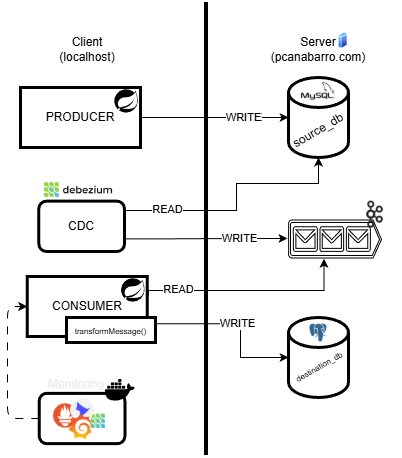

# ETL Optimization with Apache Kafka

This repository contains a project that demonstrates an ETL (Extract, Transform, Load) process optimization using Apache Kafka. It showcases a real-time data pipeline that captures changes from a MySQL database, processes them with Kafka, and loads them into a PostgreSQL database.

## Project Overview

This project implements a fully functional real-time ETL pipeline using Apache Kafka, Debezium, MySQL, and PostgreSQL. Instead of inserting messages directly into Kafka, the system captures database changes (INSERT, UPDATE, DELETE) from a transactional MySQL instance through Debezium’s CDC (Change Data Capture) mechanism. These events are streamed into Kafka topics and processed asynchronously by scalable Kafka consumers written in Java. The transformed data is finally persisted into a reporting PostgreSQL database, ensuring consistency and low latency from end to end.

The primary goal of this architecture is to demonstrate how Kafka’s partitioning, consumer groups, CDC integration, and distributed log model can improve ETL performance and scalability in data-intensive environments. The pipeline simulates real-world scenarios where applications write to operational databases, and the system replicates those changes in real-time to analytical storage with no data loss and without tightly coupling the systems involved.

## Architecture

The architecture of this project is illustrated in the diagram below:



## How to Run

This project uses Docker and Docker Compose to manage the services. The services are organized into profiles to allow running different parts of the system independently.

### Prerequisites

- Docker
- Docker Compose

### Profiles

- `server`: Runs the core infrastructure services: Zookeeper, Kafka, MySQL, and PostgreSQL.
- `client`: Runs the client-side services: Debezium Connector, Kafka UI, Prometheus, and Grafana.
- `all`: Runs all services.
- `monitoring`: Runs the monitoring services: Prometheus and Grafana.

### Running the Services

You can run the services using the following Docker Compose commands. There are two docker-compose files, one for local development and one for production.

#### Local Environment

The `docker-compose-local.yaml` file is configured for a local environment.

**Run all services:**

```bash
docker-compose -f docker/docker-compose-local.yaml --profile all up -d
```

**Run only the server profile:**

```bash
docker-compose -f docker/docker-compose-local.yaml --profile server up -d
```

**Run only the client profile:**

```bash
docker-compose -f docker/docker-compose-local.yaml --profile client up -d
```

#### Production Environment

The `docker-compose.yaml` file is configured for a production environment.

**Run all services:**

```bash
docker-compose -f docker/docker-compose.yaml --profile all up -d
```

**Run only the server profile:**

```bash
docker-compose -f docker/docker-compose.yaml --profile server up -d
```

**Run only the client profile:**

```bash
docker-compose -f docker/docker-compose.yaml --profile client up -d
```

### Accessing the Services

- **Kafka UI:** [http://localhost:8085](http://localhost:8085)
- **Grafana:** [http://localhost:3000](http://localhost:3000)
- **Prometheus:** [http://localhost:9090](http://localhost:9090)
- **Debezium Connector:** [http://localhost:8083](http://localhost:8083)
- **MySQL:** `localhost:3306`
- **PostgreSQL:** `localhost:5432`
- **Kafka:** `localhost:29092`